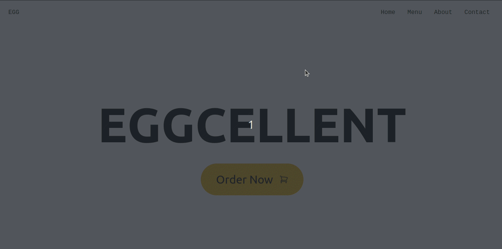

# Eggcellent page - React & Tailwind 🥚🥚🥚🥚🥚

> # Description 

The website of a restaurant that specializes in dishes made with eggs. A simple website, styled with Tailwind CSS and the links made with react-router-dom.

Available here: [Eggcellent - Vítor F. Nery](https://eggcellent-vitorfnery.netlify.app/)

## 🛠️ Technologies 

- React
- Tailwind CSS
- Git and Github
